# Safety Monitor Mobile

건설 현장 작업자의 안전모 착용 여부를 이미지, 동영상, 모바일 앱 입력으로 분석하는 멀티모달 안전 모니터링 프로젝트입니다. YOLOv8 기반 PPE 탐지 모델과 보조 headwear 분류기를 결합해 안전모 착용, 일반 캡/모자 착용, 안전모 미착용 상태를 구분하고, 위험 이벤트를 시각/텍스트/음성 경고와 로그로 제공합니다.

## Demo

### Photo Analysis

[음성 포함 사진 분석 데모 영상](docs/assets/readme/photo.mp4)

| 입력 및 분석 | 분석 결과 | 위험 상세 |
|---|---|---|
| 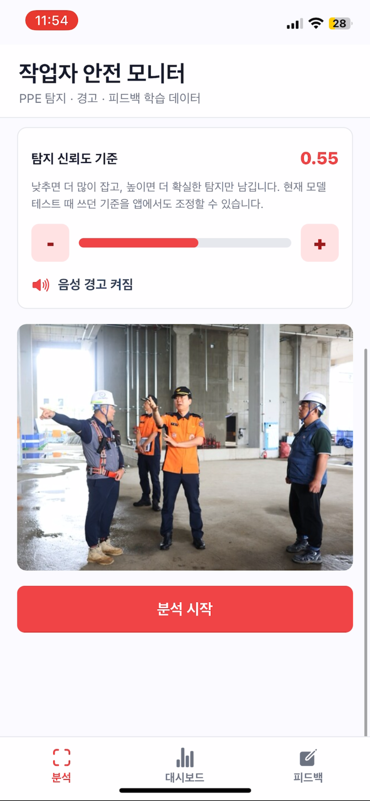 | 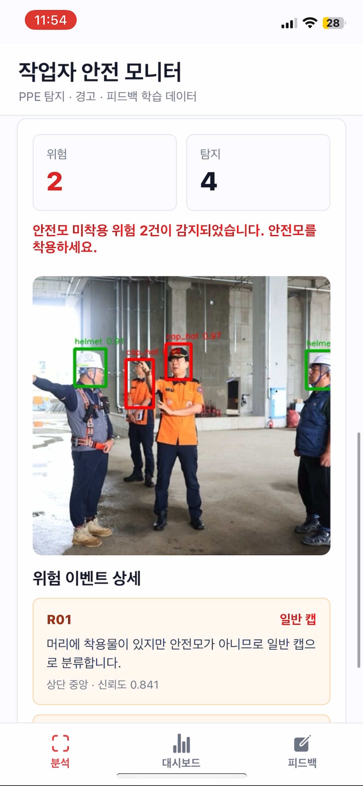 | 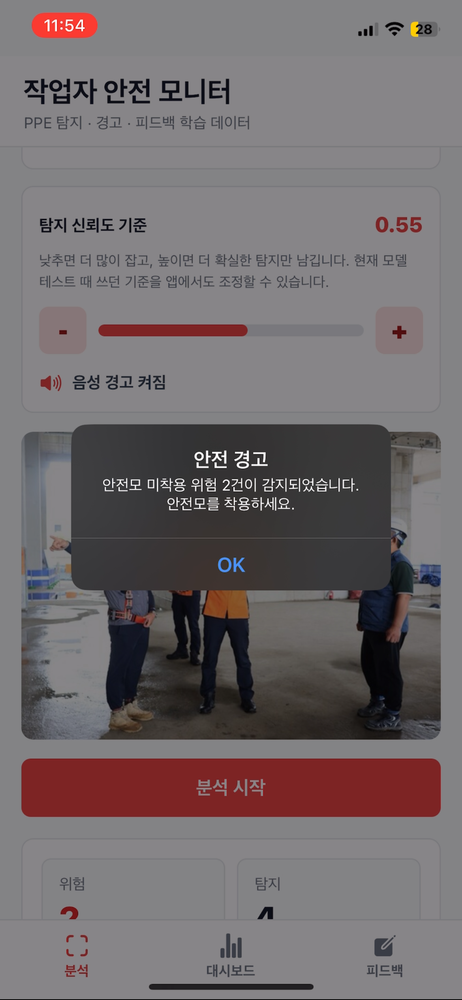 |

### Video Analysis

[음성 포함 동영상 분석 데모 영상](docs/assets/readme/video.mp4)

| 동영상 분석 | 결과 미리보기 | 이벤트 요약 |
|---|---|---|
| 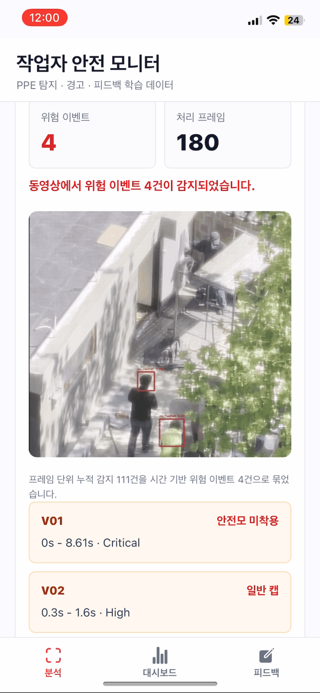 | 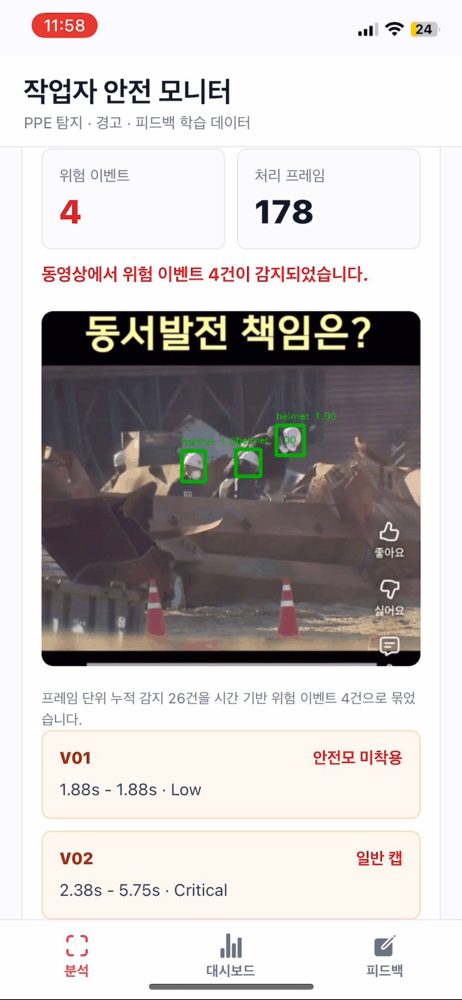 | 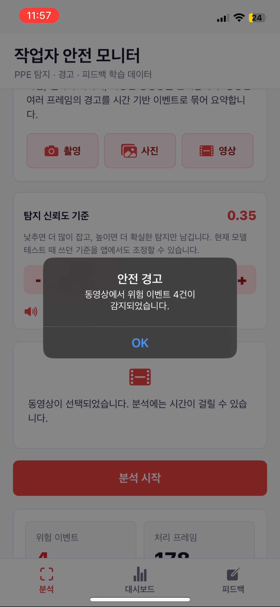 |

### Dashboard and Feedback

| 누적 대시보드 | 기간 기반 대시보드 | 피드백 저장 |
|---|---|---|
| 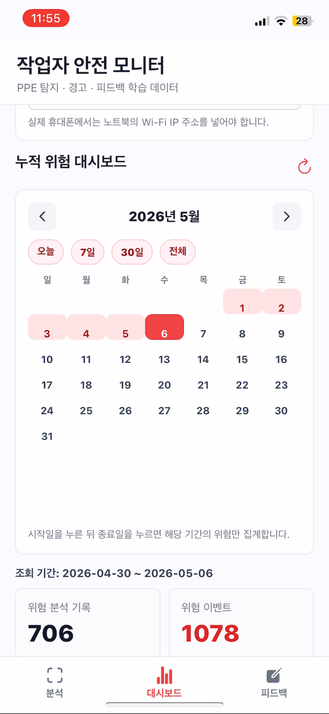 | 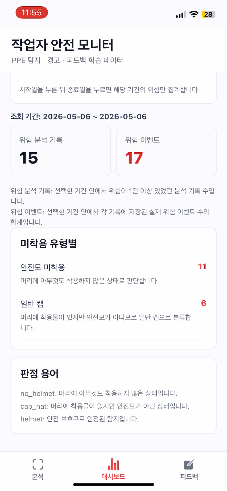 | 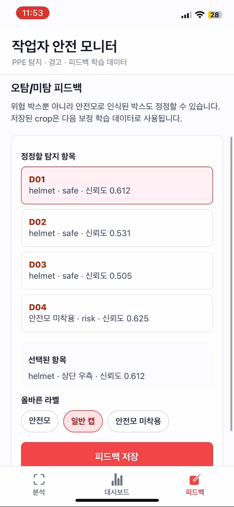 |

| 피드백 반영 예시 | 동영상 피드백 | 동영상 학습 데이터 |
|---|---|---|
| 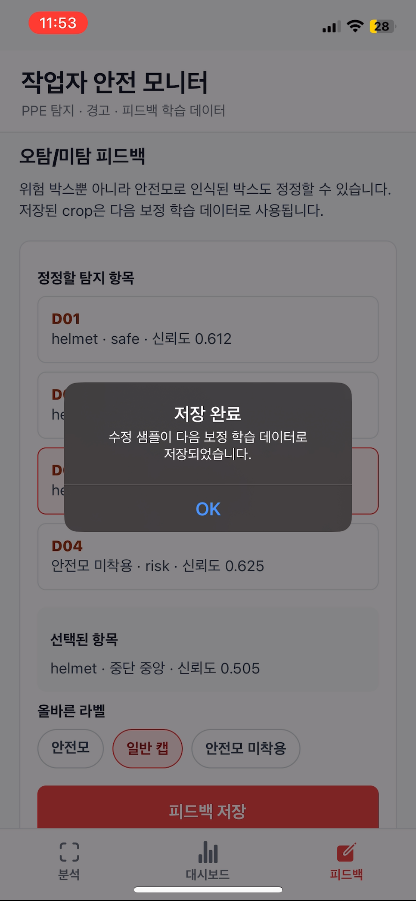 | 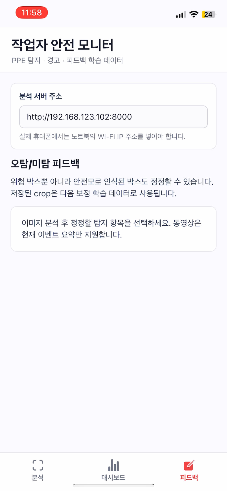 | 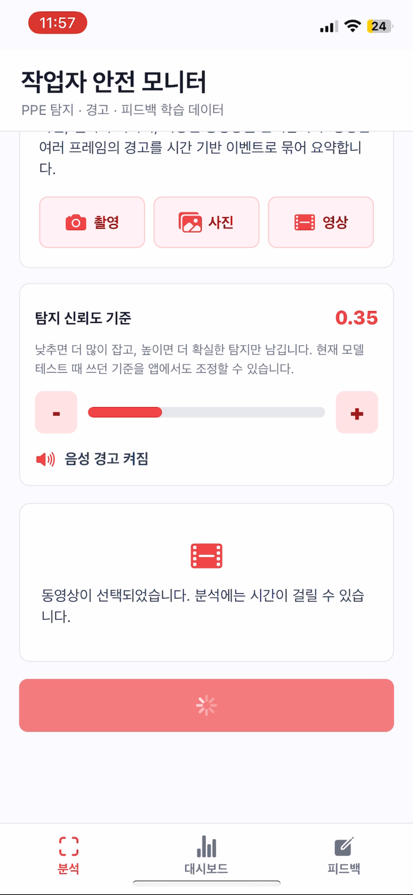 |

## Key Features

- 이미지 분석: 건설 현장 사진에서 안전모 착용 여부를 탐지합니다.
- 동영상 분석: 업로드한 영상의 일부 프레임을 분석하고, 연속 프레임 탐지를 하나의 위험 이벤트로 묶습니다.
- 모바일 앱: Expo 기반 모바일 앱에서 촬영/갤러리 업로드/영상 분석을 수행합니다.
- 멀티모달 경고: 빨간 바운딩 박스, 텍스트 메시지, 선택적 음성 안내를 함께 제공합니다.
- 위험 이벤트 로그: 분석 시간, 입력 유형, 위험 개수, 메시지를 CSV 로그로 저장합니다.
- 누적 위험 대시보드: 사용자가 선택한 기간의 위험 분석 기록과 위험 이벤트를 집계합니다.
- 오탐/미탐 피드백: 잘못된 탐지 결과를 올바른 라벨로 저장해 추후 보조 분류기 재학습 데이터로 활용할 수 있습니다.
- 일반 캡/모자 분리: 안전모가 아닌 일반 캡/모자는 별도 위험 유형으로 분리합니다.

## Detection Policy

이 프로젝트는 현장 안전 관점에서 다음 기준으로 판정합니다.

| 판정 | 의미 | 처리 |
|---|---|---|
| `helmet` | 정상적인 안전모 착용 | 안전 |
| `cap_hat` | 일반 캡, 모자, 후드 등 안전모가 아닌 착용물 | 위험 |
| `no_helmet` | 머리에 아무것도 착용하지 않은 상태 | 위험 |
| `no_helmet_person` | 사람은 감지됐지만 상단 영역에서 안전모가 확인되지 않은 보조 판정 | 위험 |

앱 화면에서는 사용자 이해를 위해 위험 유형을 크게 `일반 캡/모자`와 `안전모 미착용` 중심으로 보여주도록 설계했습니다.

## System Architecture

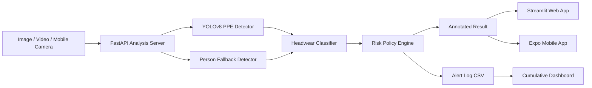

## Project Structure

```text
.
├── app.py                         # Streamlit web app
├── api_server.py                  # FastAPI backend for mobile app
├── desktop_app.py                 # Desktop wrapper experiment
├── src/
│   ├── detector.py                # YOLOv8 detection and headwear verification
│   ├── video.py                   # Video frame sampling and event grouping
│   ├── alert.py                   # Risk message rules
│   └── logger.py                  # CSV event logging
├── scripts/
│   ├── prepare_yolo_dataset.py
│   ├── train_yolov8.py
│   ├── prepare_headwear_classifier_dataset.py
│   ├── train_headwear_classifier.py
│   └── training_status.py
├── mobile_app/
│   ├── App.tsx
│   └── src/api.ts
└── docs/assets/readme/            # README demo images and videos
```

## Setup

### 1. Python Environment

```powershell
pip install -r requirements.txt
```

### 2. Model Files

Model weights are not included in this repository because they are large generated artifacts. Place trained weights in the following paths:

```text
models/best.pt
models/headwear_cls.pt
```

- `models/best.pt`: YOLOv8 safety helmet detection model
- `models/headwear_cls.pt`: second-stage classifier for `helmet`, `cap_hat`, `bare_head`

If these files are missing, the app may fall back to default YOLO models, but real safety helmet performance will be limited.

## Run

### Streamlit Web App

```powershell
streamlit run app.py
```

### FastAPI Analysis Server

```powershell
.\run_api_server.bat
```

The API server runs on:

```text
http://127.0.0.1:8000
```

For a physical phone, use the laptop's Wi-Fi IP address in the mobile app, for example:

```text
http://192.168.x.x:8000
```

### Expo Mobile App

```powershell
cd mobile_app
npm install
npx expo start
```

Then scan the QR code with Expo Go.

## Training

### YOLOv8 Helmet Detector

```powershell
python scripts/prepare_yolo_dataset.py
python scripts/train_yolov8.py
```

For longer training on GPU:

```powershell
python scripts/train_yolov8.py --epochs 70 --batch 16 --device 0
```

Training progress can be checked with:

```powershell
python scripts/training_status.py --run runs/train/hardhat-plus-yolov8n-70e --epochs 70
```

### Headwear Classifier

The second-stage classifier is used to reduce confusion between hard hats, caps, and bare heads.

```powershell
python scripts/prepare_headwear_classifier_dataset.py
python scripts/train_headwear_classifier.py
```

Manual feedback crops saved through the app can be reused as additional classifier data.

## Feedback Loop

The feedback screen is designed for model improvement, not just manual correction.

1. The model predicts a wrong label.
2. The user selects the correct label: `helmet`, `cap_hat`, or `bare_head`.
3. The crop is saved under `data/headwear_cls/manual/`.
4. The classifier dataset is rebuilt.
5. The headwear classifier is retrained and copied to `models/headwear_cls.pt`.

This creates a small active-learning loop for improving edge cases found during app testing.

## Limitations

- The system is a prototype and should not be used as a final safety-critical product without field validation.
- Performance depends heavily on dataset quality, camera angle, lighting, distance, and occlusion.
- General caps, hooded clothing, partial helmets, and low-resolution video frames can still cause false positives or false negatives.
- The mobile app currently sends images/videos to a local FastAPI server instead of running the model fully on-device.
- Model weights and datasets are excluded from GitHub and must be prepared separately.

## Future Work

- Improve the headwear classifier with more balanced `helmet`, `cap_hat`, and `bare_head` samples.
- Add on-device inference using TensorFlow Lite, Core ML, or ONNX Runtime Mobile.
- Add event-level confidence smoothing for videos.
- Add exportable safety reports for selected date ranges.
- Add role-based dashboard views for site managers and safety officers.
- Expand from helmet detection to multi-PPE detection such as vest, gloves, harness, and unsafe posture.

## Tech Stack

- Python
- YOLOv8 / Ultralytics
- OpenCV
- FastAPI
- Streamlit
- React Native / Expo
- Pandas

## Repository

GitHub: [safety-monitor-mobile](https://github.com/ChaewonHwang-01/safety-monitor-mobile)
